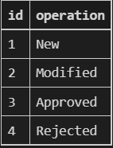
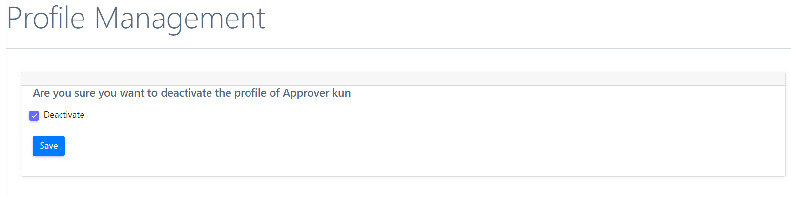

**License Management Software User Manual**

# Contents

About the Product:

License Life Cycle:

    Uploader Flow:

    Approver Flow:

    Publisher Flow:

    Admin Flow:

Admin Tasks:

Uploader Tasks:

Approver Tasks:

Publisher Tasks:

# 

# 

# 

# 

# 

# 

# 

# 

# 

# 

# 

# About the Product:

The SPDX License Management Software is to maintain the workflow of the
Managing the Licenses. The actors for maintaining the software are

1.  Super User: Super User who has the highest Privileges in the system
    is created as part of the Product Installation and setup. The
    installation steps are documented in the Installation document. The
    list of tasks the super user can perform is as below:

    a.  Set up Statuses

        i.  We have a DB table to store the list of Predefined Status in
            the system and these would need to be manually setup by the
            Super User. The list of Status in the system are:

> 

b.  Roles:

    i.  Every User accessing the system should be assigned a specific
        Role. The list of User Roles in the system are Admin, Approver,
        Publisher and Uploader

c.  Operation Types

    i.  As part of the License Life Cycle, tracking is done and there
        are operation types associated to each action, the list of
        Operation types are:

> 

d.  Admin User:

    i.  Super User first creates an Admin User as part of the Product
        Installation, later all Admin tasks are taken over by the Admin
        User. The list of Admin tasks are detailed in the Admin Flow
        section below.

# License Life Cycle:

# 

> 
>
> The Lifecycle of a License is pictorially described above.

-   **[Draft License:]**

    -   New License Added into the system would be in the Draft Status.
        Uploader can modify a Draft license.

    -   Approver can see all Draft Licenses in the system for Approval/
        Rejection.

-   **[Approved License:]**

    -   When Approver Picks up a Draft License and Approves the same,
        the status of the License would change to Approved.

    -   Publisher can see all Approved Licenses for Publishing.

-   **[Rejected License:]**

    -   When Approver Rejects a Draft License, the status of the License
        would changes as Rejected.

    -   License in Rejected Status would be treated same as a Draft
        License, where in

        -   Uploader can View and Edit the Draft Licenses

        -   Approver can Also see all Rejected Licenses just Like Draft
            Licenses and Pick them up for Approval.

# Account Creation and Login:

a.  Create Account: The required Details would be entered in this Screen

## 

## 

b.  Login

> 

# 

# Uploader Flow:

Uploader user comes fist in the License Life cycle, uploader uploads new
Licenses into the system and modifies/ makes correction to the New/
Rejected Licenses in the system for Approval. The list of tasks Uploader
can perform are:

a.  Upload a New License

b.  Edit the Draft and Rejected Licenses

## Uploader Tasks:

a.  Uploader Dashboard

> 

b.  Upload a New License for Approval

    a.  Click on Upload

> 

b.  Enter Licenses Details and click on Send

> 

c.  Edit the Draft and Rejected Licenses for Approval

    a.  Click on Edit Licenses in the navbar

> 

b.  Select a license you want to edit and click on edit

> 

c.  Edit the licenses and click on send

> 

# Approver Flow:

Approver user can Approve OR Reject the Licenses in the System, Approver
can view New Licenses in Draft status/ Rejected Licenses that have been
Modified. The list of tasks Approver can perform are:

a.  View New Licenses in Draft Status or Rejected Licenses that have
    been modified in the Rejected Status.

b.  Approve the Licenses in Draft Status.

c.  Reject the Licenses Draft Status with reasons for Rejection.

## Approver Tasks 

a.  Approver Dashboard


b.  View New Licenses in Draft Status

    a.  Select the Uploaded License List from the navbar

> 

b.  The screen below Is visible with all the in-draft licenses


The in-draft licenses can be downloaded for offline viewing

c.  Approve the Licenses in Draft Status or Rejected Licenses.

    a.  Select the license you want to approve and click on view


b.  Enter the comments and click on approve


d.  Reject the Licenses Draft Status or Rejected Licenses with reasons
    for Rejection.

    a.  Select the license you want to approve and click on view


b.  Enter the comments and click on Reject


# Publisher Flow:

Publisher user can Select and Publish the Approved licenses in the
System. Publisher can select One OR more Licenses from the List and
Publish. Publisher can add the Header details before publishing the
License data. The header details can be saved into the Database and can
be reused to auto fill for subsequent exports. The header information
can be modified at any time as part of the export process. The list of
tasks Approver can perform are:

a.  Approved License Export

b.  Modify the License Header information of the export data.

## Publisher Tasks

a.  Publisher Dashboard

> 

b.  Modify the License Header information of the export data.

    a.  Click on Export Header Maintenance

> 

b.  Enter the header information and click on save

> 

c.  Approved License Export

    a.  Click on Approved Licenses

> 

b.  Select the licenses you want to publish and click on 'Download File
    to Publish'


# Admin Flow:

Admin User can perform all the tasks of an Uploader, Approver, Publisher
and also Admin Tasks. The list of tasks Admin can perform are:

## Admin Tasks:

a.  Admin Dashboard

> 

b.  License Management

    a.  Select Licenses Maintenance

> 

b.  Select the action to be performed

> 

c.  Deactivate User Profile

    a.  Click on User Maintenance

> 

b.  Select the user you want to perform an action on and select
    deactivate profile

> 

c.  Check the deactivate button and click on save

> 

d.  View User Activity

    a.  Click on User Maintenance

> 

b.  Select the user you want to perform an action on and select
    deactivate profile

> 

c.  Check the deactivate button and click on save

```{=html}
<!-- -->
```
e.  Add Role

    a.  Click on User Maintenance

> 

b.  Select the user you want to add a role to

> 

c.  Check the required roles you want to give the user and click on save

> 

f.  Remove Role

    a.  Click on User Maintenance

> 

b.  Select the user you want to remove a role of

> 

c.  De-select the required roles and click on save


g.  Name Space Maintenance

    a.  Click on Namespace Maintenance

> 

b.  Change the namespace and click on save


h.  User Activity Tracking

    a.  Click on User Maintenance

> 

b.  Select the user check the activity of


## 
