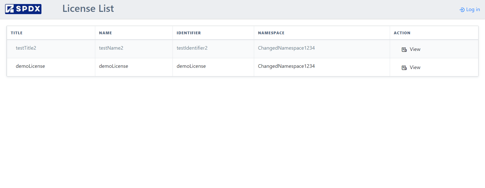

**License Management Software Deployment Manual**

# Contents

Local Deployment:

Deployment on AWS (using Elastic Beanstalk)

Deployment using pythonanywhere

# 

# 

# 

# 

# 

# 

# 

# 

# 

# 

# 

# Local Deployment

**STEP-1:**

Clone the repository or download the source code from the repository

**STEP-2:**

-   Download the python packages mentioned in 'requirements.txt'.

-   The same packages, along with the versions used during development
    are given below.

-   Creating a virtual environment is helpful but not a necessity.

asgiref==3.5.2

certifi==2022.6.15

charset-normalizer==2.1.0

defusedxml==0.7.1

diff-match-patch==20200713

Django==4.0.5

django-import-export==2.8.0

et-xmlfile==1.1.0

idna==3.3

MarkupPy==1.14

odfpy==1.4.1

openpyxl==3.0.10

PyYAML==6.0

requests==2.28.1

responses==0.21.0

sqlparse==0.4.2

tablib==3.2.1

tzdata==2022.1

urllib3==1.26.9

xlrd==2.0.1

xlwt==1.3.0

If the package you download is a newer version, do not worry.

**STEP-3:**

-   Open the directory you are using.

-   If you have installed the packages in a virtual environment,
    activate it

**STEP-4:**

-   Type the following command in the root directory of the source code
    in the cloned repository.

> 'python .\\manage.py runserver'

-   The local Django server should start.

**STEP-5:**

-   In your browser and open your localhost or click on the URL given
    when the server starts

-   You should see the landing page of the application

**STEP-6:**

-   A few accounts have already been created including the super user.

-   Logging-in using the superuser account, existing accounts can be
    deleted.

# AWS deployment (using Elastic Beanstalk):

# 

**STEP-1:**

Clone the repository or download the source code from the repository

**STEP-2:**

-   Open your AWS Management Console

> 

-   Search for Elastic Beanstalk and click on create application

**STEP-3:**

Give a name to your application

**STEP-3:**

Select the latest python version as the platform for the application

**STEP-5:**

-   In the cloned repository, select the following files and compress
    them.

-   Upload this compressed file and click on create application.

**STEP-6:**

-   This manual uses a free tier subscription to AWS.

-   You can configure the settings of the application as per your
    requirements.

**STEP-7:**

-   Leave any default environment variables as is.

-   Add the IS_PRODUCTION and APP_HOST and set them as below

**STEP-8:**

Click on create app.

**STEP-9:**

After the application is set up and is running, when you click on the
URL of your application, you will see the following error

**STEP-10:**

-   Go back to the environment properties and set the APP_HOST to the
    domain assigned to you.

-   You can also connect your own domain or enable SSL

**STEP-11:**

The deployment is updated and clicking on the domain will take you to
the landing page of the application

# PythonAnywhere Deployment:

**STEP-1:**

Clone the repository or download the source code from the repository

**STEP-2:**

-   Open python anywhere

-   This document shows the deployment on a free account

**STEP-3:**

Open the bash

**STEP-4:**

-   Clone the repository

-   Create a virtual environment using the following command:

mkvirtualenv --python=/user/bin/python3.10 mysite-virtualenv

**STEP-5:**

Install django

**STEP-6:**

Open pythonanywhere on a new tab and click on Web

**STEP-7:**

-   Click on 'Add a new web app'

-   Click on manual configuration and select python 3.10

**STEP-8:**

-   Open Virtualenv

-   Add the name of the virtual env (mysite-virtualenv) and save

**STEP-9:**

Open the WSGI settings

**STEP-10:**

-   Find the directory where the manage.py file resides and change the
    path to it

-   Change the settings environment variable to the directory where the
    settings.py file resides ('SPDX_license_management_system.settings')

**STEP-11:**

Save and open the domain

**STEP-12:**

-   The issue can be solved by changing the APP_HOST in settings.py to
    include the domain name of the application

-   Add /static/ to URL and '/static/' to the Directory under Static
    files to render the styles to the application

