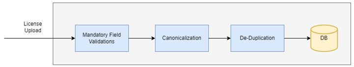
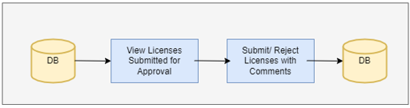
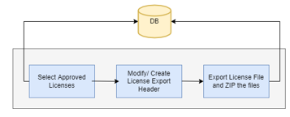
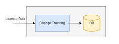
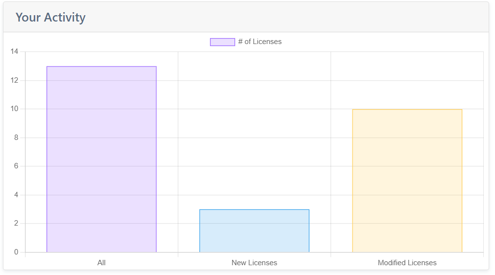
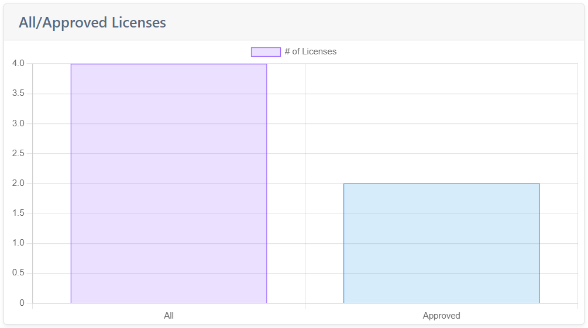
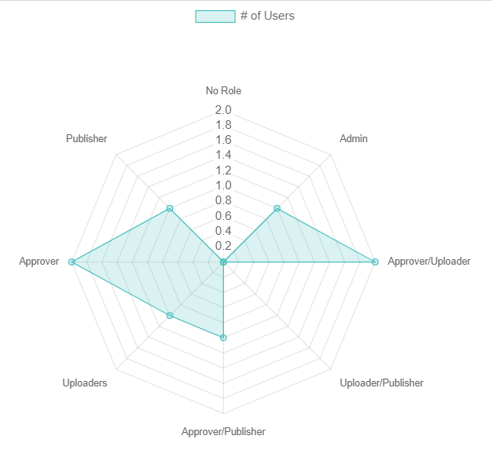

##### 

##### **License Management System**

"Private license management system". Is web-based system for managing
license texts; like the SPDX License List but oriented towards other
private collections of licenses.

# Requirements/ Goal:

The goal of the project would be to create a simple web application for
users to upload license texts and automatically create a license
repository. Requirements is to

-   Create an input form where the Licensing information is entered.

-   In-built validations to accept clean license data. The list of
    validations are summarized below: -

    -   **Canonicalization**: Converting the License data
        into a normalized format.

    -   **De-Duplication**: Avoidance of Duplicate license
        data, multiple rules to validate and check for supplication.

    -   **Mandatory field validations**: Check for the
        Mandatory data, accept the license data only in cases where the
        mandatory data is available.

-   Review/approval (and naming) process: Creation of business flows for
    the below cases:

    -   **Upload & Approval Flow**

    -   **Reject, Modify and Approve Flow**

    -   **Publishing Flow: Publish the Approved licenses in the system**

-   Convert Approved Licenses to a specified Standard format: Flow to
    convert all the Licenses in the system into a standard format.

# 

# Project Summary

We developed a Web based Application with a consideration to use open
source Technologies. The Application was created on a Three tier
architecture with Light front end tier, all business functionality
included in the Middle tier and Database as the Data Tier.

-   Front end Tier: Front end was developed using the
    HTML, CSS, JavaScript, jQuery, Boot strap, Chart.js.

-   Middle Tier: the Business logic was developed on
    Python Django.

-   Back End/ Data Layer: SQLite was the database we
    choose to persist the data. We went with SQLite as data volumes was
    less.

Modules were created in the application with provisioning the User
management, License data management, UI Analytics. Each of the Modules
is explained in detail in the below sections.

**User Management Module**

This module covers the users' role and users' maintenance, where we can
create, modify, delete user roles and users. We have dedicated roles
associated to each functionality in the application. Each Role is
associated to multiple functionalities and any user in the system can be
associated to more than one Role.

Different Roles in the system are:

1.  Super User Role

> This user is created when we install the application would be the
> super user. There can be ONLY ONE super user in SPDX Application.
> Super user creates the first Admin user for the application.

2.  Admin User Role

> This Role is a privileged Account in SPDX, Admin user can perform all
> the below tasks in the SPDX Application:

-   User Role Maintenance: Create, Modify and Delete User
    Roles.

-   User Maintenance: Create, Modify and Delete Users.
    Each User in the system would be associated to one or more Roles.

-   Super set of Other Roles: Admin User can act as an
    Uploader, Approver and Publisher which means all the functionalities
    available for these roles would be available to Admin role as well.

-   Override Status: Admin Role has access to all the
    License data and Status and can change it directly in the system at
    any point in time. He can override the Process and update the
    license status.

3.  Uploader Role

> User with the uploader Role can perform the following actions:

-   Upload a new License into the system and submit for approval.

-   View all Licenses in the System.

-   Modify Licenses which are in status New and Rejected.

4.  Approver Role

> User with the Approver Role can perform the following actions:

-   View all Licenses in the System.

-   Approve a New License/ Rejected License that is submitted for
    approval.

5.  Publisher Role

> User with the Publisher Role can perform the following actions:

-   View all Licenses in the System.

-   Publish one or more Approved Licenses in the system.

**License Data Management Module**

This is core Module which handles the License Management. The
Functionalities that are handled by this Module are: -

-   **License Upload**:

> This Module covers the Functionalities around the License Upload Flow.
>
> 
>
> The list of processes the new License data goes through are detailed
> as below. Only when a step is successful, data is passed on to the
> next step, incase of any validation Error the error is thrown back to
> the user.

-   Mandatory Field Validations:

> The Mandatory fields in the License entry form are validated here.

-   Canonicalization:

> The requirements are not finalized. We are approaching this problem in
> two steps as part of this version:
>
> The license data is simplified according to SPDX License List Matching
> Guidelines, v2.1 (https://spdx.dev/license-list/matching-guidelines/ )
> where Guidelines 3, Guidelines 4, Guidelines 5, Guidelines 8,
> Guidelines 9 and Guidelines 13 have been implemented.

-   De-Duplication:

> This process checks if the license that is uploaded already exists in
> the system. The validation is based on the License contents and
> certain key fields

-   **License Approve**:

> 
>
> The list of processes in the License Approval flow is included in this
> process. User selects the lists of Available licenses for approval,
> these would include new Licenses submitted for approval OR rejected
> licenses modified and submitted for approval.

-   **License Publish:**

> 
>
> This flow includes process to Publish the Approved files in the
> system. User selects Approved licenses in the system and publishes
> them. There would be an option to Edit OR Add the Header fields before
> the data is exported.

-   **Change Tracking:**

> 
>
> Every change in the License data is tracked in the system. Every
> action/ change is associated with a change code and the License file
> with changes in tracked at the database level. There is an UI to check
> the list of changes that has undergone for each License file.

**UI Analytics Module**

> This module includes all the Analytical reports included in the
> system. Each user role has access to specific reports. The reports is
> explained below:

